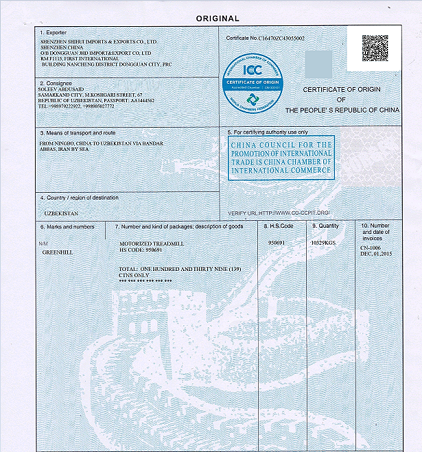

---   
layout: default-layout
description: 本文介绍如何在不同场景下选择合适的定位模式，来得到最优的码区定位结果
title: 码区定位
keywords: localization,barcode area
needAutoGenerateSidebar: false
---

# 如何使用不同的定位模式来获得最优的码区定位结果

DBR提供了多种定位模式来定位码区，不同模式有其自身的适用场景和特点，本文会详细介绍如何在不同场景下选择合适的定位模式，来得到最优的码区定位结果。

## LM_CONNECTED_BLOCKS

基于联通块的定位模式，该模式使用图像的联通块信息进行定位，所以需要图像中存在码区特征明显的联通块，通常适用于图像清晰、码区粘连不严重的情况。如下图

![original-barcode][1]

该图像的联通块信息清晰、码条特征明显，绘制在图上后，如下

![original-barcode-contours][5]

## LM_LINES

基于直线的定位模式，该模式使用图像中的直线数据进行码区定位。适用于码区直线特征明显的图像，相比LM_CONNECTED_BLOCKS模式，可以很好的处理码区发生粘连的情况。如下图，因为2条污染的存在，图片的联通块信息被破坏，无法体现出码条特征

![contaminated-barcode][2]

但是图像的直线信息依然能体现出码条特征，如下图

![contaminated-barcode-lines][7]

像这种情况，使用LM_LINES即可完成码区的定位。

## LM_STATISTICS

基于颜色统计的定位模式，适用于码区破坏严重，联通块和直线都无法体现出码区特征的场景。例如原始图像较大，但是码区很小，这样图像二值化后码区特征可能会破坏严重，如下图



该图二值化后码区的定位角块破坏严重，如下所示：

![contaminated-barcode-lines][9]

因其码区附近有比较明显的黑白特征，使用LM_STATISTICS可以成功定位到

## LM_SCAN_DIRECTLY

基于直接扫描的定位模式，通过在图片上扫描来寻找码区，速度在所有定位模式中最快，但也需要码区清晰度较高，码区的方向也只能是水平或竖直，倾斜方向成功率较低。适用于速度敏感场景。例如视频交互场景，利用摄像头扫码识别，每一帧的图像处理耗时不可过长，同时某些不清晰的图像帧并不会影响整体效果。

该模式下还有两个额外的argment参数ScanStride和ScanDirection。
- ScanStride   
设置相邻扫描线的间隔，单位为像素，默认值为0，0代表DBR自动计算间隔。该值设置越小越可能定位码区，但也会增加花费的时间。
- ScanDirection   
设置扫描方向，取值为0，1，2，默认值为0，0代表水平和垂直方向都进行扫描，1为只对垂直方向进行扫描，2为只对水平方向进行扫描。减少尝试的扫描方向，可以提高DBR的处理速度

## LM_STATISTICS_MARKS

基于图像点阵信息进行码区定位，该模式仅适用于DPM Code和Dotcode。如果你需要处理DPM或者DotCode，那么需要配置该模式。下图是一个典型的Dotcode

![dotcode][3]

## LM_STATISTICS_POSTAL_CODE：

基于统计连通块和直线来定位PostalCode，该模式仅适用于PostalCode。PostalCode例图如下

![postalcode][4]

## LM_CENTRE

中心定位，该模式以图像中心区域为码区疑似区，尝试进行定位解码。

## 利用中间结果观察定位数据

如果DBR成功定位到码区，可以利用中间结果IRT_TYPED_BARCODE_ZONE来观察定位结果。定位结果的信息包括："angle"（码区角度）,"barcodeFormat"（条码类型）,"confidence"（码区定位分数）,
"moduleSize"（码条modulesize）,"pageNumber"（位于第几页）,"terminatePhase"（终止阶段）,
"x1y1x2y2x3y3x4y4"（码区定位点坐标）。

## 配置示例

下面演示在RuntimeSetting和Json配置定位模式

示例程序：

```cpp
    char sError[512];
    CBarcodeReader* reader = new CBarcodeReader();
    reader->InitLicense("填入Lisence");
    PublicRuntimeSettings* runtimeSettings = new PublicRuntimeSettings();
    reader->GetRuntimeSettings(runtimeSettings);          //取出当前的模板参数    
    runtimeSettings->localizationModes[0] = LM_LINES;     //只使用LM_LINES一种定位模式
    runtimeSettings->localizationModes[1] = LM_SKIP;
    runtimeSettings->localizationModes[2] = LM_SKIP;
    runtimeSettings->localizationModes[3] = LM_SKIP;
    reader->UpdateRuntimeSettings(runtimeSettings);
    reader->DecodeFile("填入图片路径", "");                //解码    
    TextResultArray* result = NULL;
    reader->GetAllTextResults(&result);                   //获得解码结果
    int icount = result->resultsCount;
    CBarcodeReader::FreeTextResults(&result);
    delete runtimeSettings;
    delete reader;
```

示例Json模板：

```javascript
{
    "ImageParameter": {
        "Name": "ImageParameter1", 
        "Description": "This is LocalizationMode demonstrate", 
        "LocalizationModes":[
            {
              "Mode":"LM_CONNECTED_BLOCKS"
            },
            {
              "Mode":"LM_SCAN_DIRECTLY",
              "ScanStride":0,
              "ScanDirection":0
            },
            {
              "Mode":"LM_STATISTICS"
            },
            {
              "Mode":"LM_LINES"
            }
          ],
         "DeblurLevel":9
    }, 
    "Version": "3.0"
}   
```


[1]:assets\how-to-set-localization-modes\original-barcode.png

[2]:assets\how-to-set-localization-modes\contaminated-barcode.png

[3]:assets\how-to-set-localization-modes\dotcode.png

[4]:assets\how-to-set-localization-modes\postalcode.png

[5]:assets\how-to-set-localization-modes\original-barcode-contours.png

[6]:assets\how-to-set-localization-modes\contaminated-barcode-contours.png

[7]:assets\how-to-set-localization-modes\contaminated-barcode-lines.png

[8]:assets\how-to-set-localization-modes\original-barcode-lines.png

[9]:assets\how-to-set-localization-modes\binarized-qrcode.png